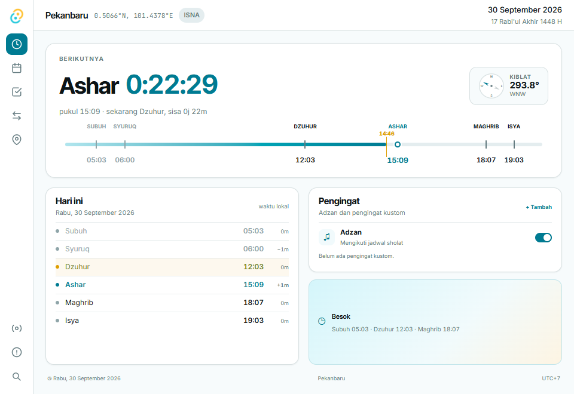
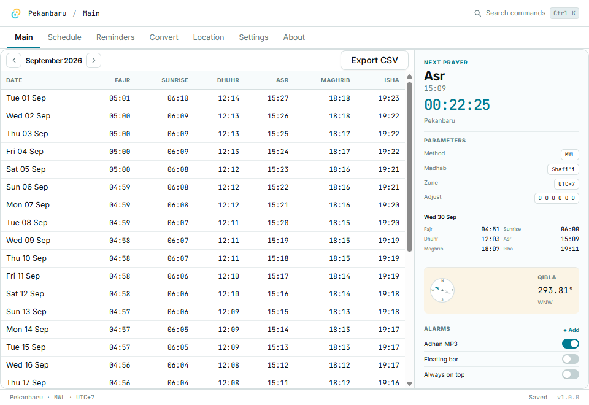

# Shollu Modern 1.0

Antarmuka mengikuti `design_handoff_shollu_ui`: Tenang memakai rail ikon dan day arc; Ringkas memakai tab, tabel bulanan, inspector, dan status bar. Pilihan mode, bahasa Indonesia/English, tiga tema, dan lima aksen disimpan bersama pengaturan aplikasi.





## Fitur

- Jadwal sholat memakai koordinat, ketinggian, zona waktu tetap, lima metode, pilihan Asar, pembulatan, dan koreksi menit. Jam dan pergantian hari mengikuti zona lokasi yang dipilih.
- Pencarian kota menggunakan basis data offline dari berkas `.spn` asli. Periksa zona waktu setelah memilih kota; basis data asli tidak menyimpan zona waktu atau aturan daylight saving.
- Halaman Lokasi memisahkan pratinjau dari pengaturan tersimpan. Simpan atau urungkan perubahan sebelum meninggalkan pekerjaan yang belum selesai.
- Kalender bulanan, detail hari, ekspor CSV/HTML/TXT dengan dialog penyimpanan native, serta konversi Masehi–Hijriah dengan koreksi −1/0/+1 hari.
- Pengingat kustom dapat dibuat, diedit, diaktifkan, dinonaktifkan, dan dihapus. Waktu pengingat kustom mengikuti waktu lokal komputer; pengingat sholat mengikuti zona lokasi.
- Notifikasi tetap berjalan ketika jendela utama disembunyikan ke tray. Audio adzan memerlukan berkas lokal pilihan pengguna; tidak ada rekaman bawaan. Syuruq tidak memicu adzan.
- Bilah melayang dan drop zone berbagi jadwal serta pengaturan, berubah ukuran mengikuti mode, dan menyimpan keadaan saat ditutup.
- Pengaturan selalu di atas dan mulai saat masuk diterapkan ke sistem operasi. Aksi pengingat seperti perintah, shutdown, dan hibernasi menjalankan aksi yang dipilih pengguna.

## Pintasan

| Pintasan | Fungsi |
| --- | --- |
| Ctrl/Cmd K | Palet perintah, halaman, dan pencarian kota |
| Ctrl/Cmd Shift M | Ganti Tenang/Ringkas |
| Ctrl/Cmd S | Simpan perubahan lokasi |
| Ctrl/Cmd E | Ekspor jadwal |
| Ctrl/Cmd ← / → | Bulan sebelum/berikutnya pada jadwal |
| Ctrl/Cmd W | Sembunyikan jendela utama ke tray |

## Pengembangan dan verifikasi

```powershell
pnpm install --frozen-lockfile
pnpm test
pnpm build
cd src-tauri
cargo fmt --check
cargo test --lib
cargo clippy --lib -- -D warnings
```

Uji native Windows memerlukan WebView2 dan aplikasi debug yang sudah dikompilasi. Jalankan `pnpm dev` pada terminal terpisah, kemudian `cargo build` di `src-tauri` dan `pnpm test:desktop` dari root. Skrip memakai folder `.smoke/native-data-*` untuk menghindari perubahan data pengguna dan menghasilkan laporan serta screenshot di `.smoke`. `SHOLLU_SMOKE_BINARY` dapat menunjuk executable release untuk menguji aset terkemas.

`SHOLLU_CONFIG_DIR` mengalihkan pengaturan, pengingat, dan basis data ke direktori terpisah. Mode ini menolak aktivasi autostart agar konfigurasi uji tidak didaftarkan ke startup komputer.

## Paket aplikasi

```powershell
pnpm tauri build --bundles nsis --config '{"bundle":{"createUpdaterArtifacts":false}}'
```

Perintah lokal di atas membuat installer Windows tanpa artefak updater bertanda tangan. Pipeline release memakai secret signing updater yang tersedia di GitHub dan membuat draft release saat tag versi dikirim. Signing updater berbeda dari Windows Authenticode dan notarization macOS; jangan menganggap installer sudah memiliki keduanya.

CI memeriksa build frontend, tes frontend, format Rust, tes Rust, dan Clippy pada Windows, macOS, dan Linux. Uji interaksi desktop dilakukan pada Windows; hasil CI platform lain tidak menggantikan uji antarmuka native pada platform tersebut.

Verifikasi lokal v1.0: 35 tes Rust, 6 tes frontend, pemeriksaan TypeScript/build, Clippy tanpa warning, dan uji native untuk ketujuh halaman di kedua mode, perubahan pengaturan, pengingat, overlay, dialog ekspor, serta audio. Aksi shutdown/hibernasi tidak dijalankan dalam smoke test agar pengujian tidak mematikan komputer.

Kredit Ebta Setiawan dan lisensi PolyForm Noncommercial 1.0.0 tetap berlaku. Lihat [ATTRIBUTION](../ATTRIBUTION.md) dan [LICENSE](../LICENSE.md).
